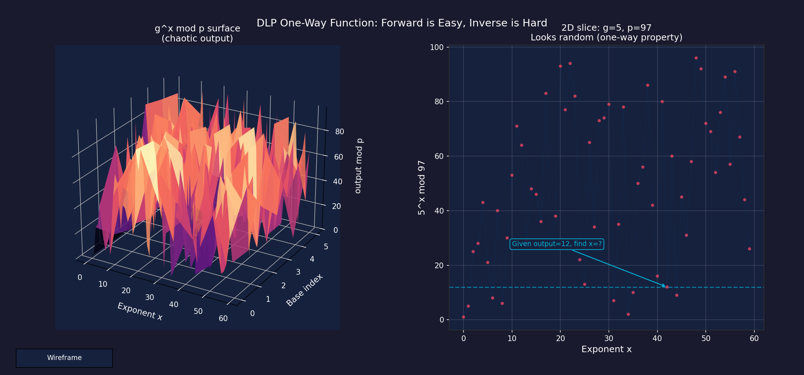
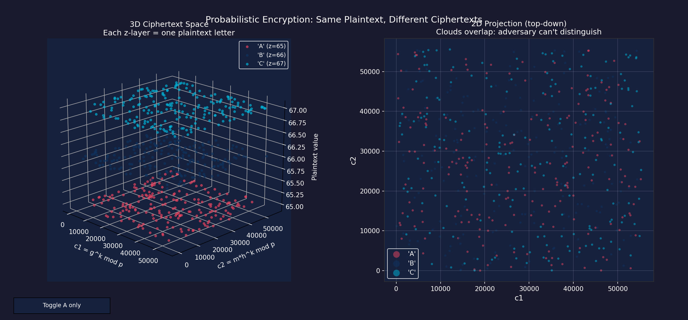
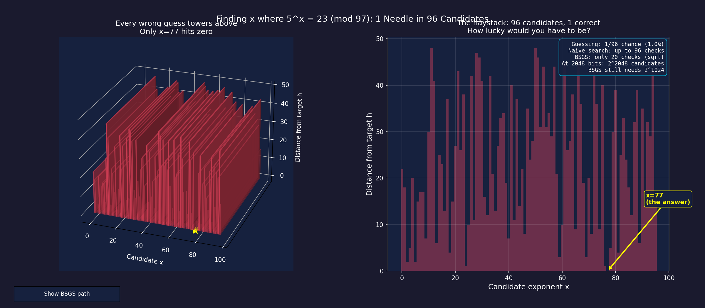

# ElGamal Encryption: Interactive 3D Demo

Python companion to my MAT331 number theory project on ElGamal public key encryption.

The Maple implementation and full writeup are in the main project directory. This repo provides an interactive demo with 3D visualizations demonstrating ElGamal encryption and the computational hardness of the Discrete Logarithm Problem.

## Files

`elgamal.py` contains the core library (keygen, encrypt, decrypt, text message handling, baby step giant step DLP solver). `elgamal_demo.py` is the interactive demo with 5 modes including 3 interactive 3D visualizations.

## Requirements

```
pip3 install matplotlib numpy colorama
```

## Usage

```
python3 elgamal_demo.py
```

The interactive menu offers five modes:

1. **Encrypt / Decrypt** generates keys, encrypts a message, decrypts it, and shows the probabilistic property.
2. **Crack a key (BSGS)** generates a key and breaks it with baby step giant step.
3. **3D: DLP One Way Landscape** renders g^x mod p as a 3D surface across multiple primes, with a 2D slice showing the inverse problem.
4. **3D: Ciphertext Cloud** plots (c1, c2, plaintext) in 3D, showing that encrypting the same letter repeatedly produces distinct z layers that overlap in projection.
5. **3D: DLP Needle in a Haystack** shows every possible exponent as a bar, with only ONE matching the target. Visually demonstrates the 1/(p-1) odds of guessing correctly, and how BSGS narrows the search from p to sqrt(p).

All 3D plots feature interactive rotation, hover annotations, and toggle buttons.

## Sample Visualizations






