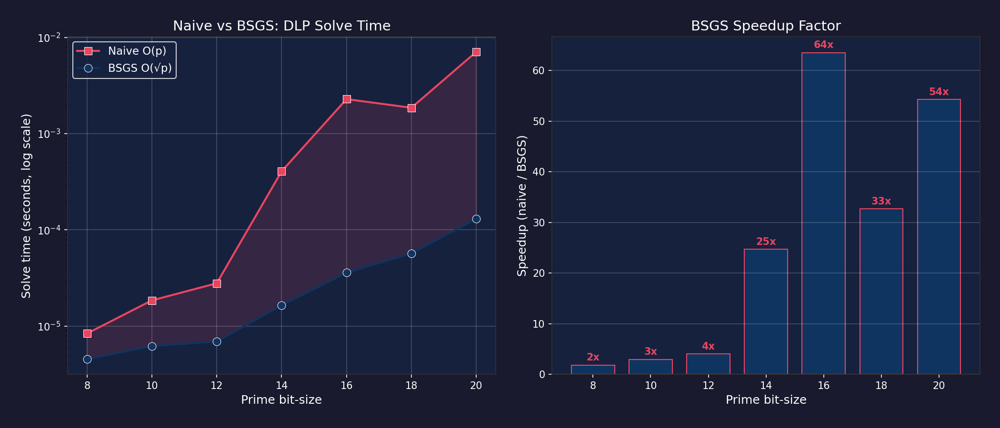
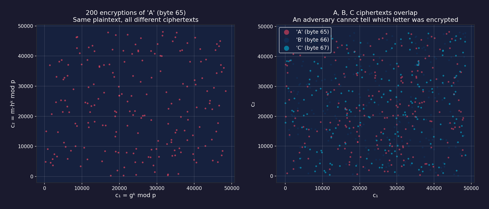
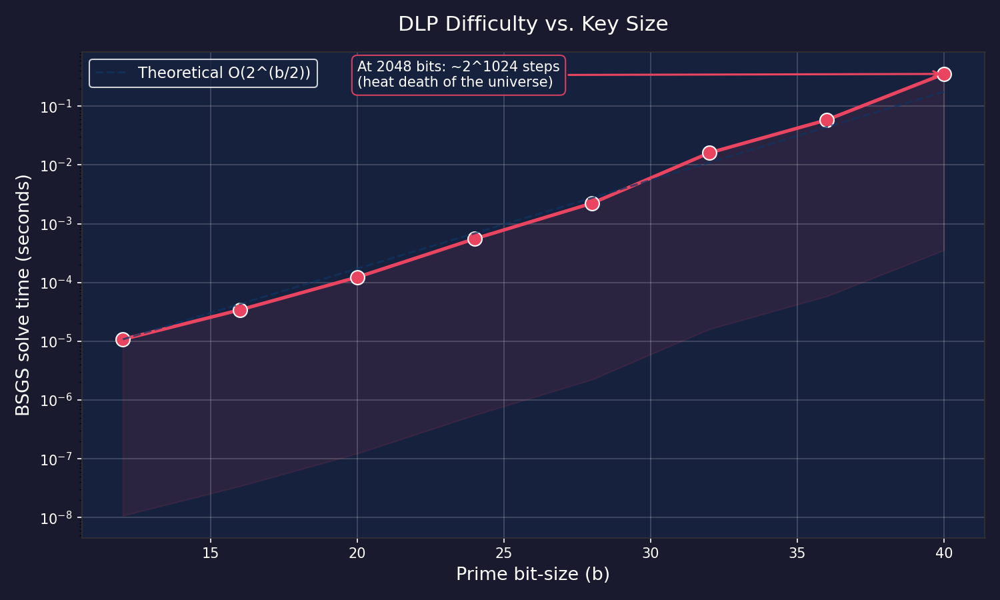

# ElGamal Encryption: Interactive Demo and DLP Visualizations

Python companion to my MAT333 number theory project on ElGamal public-key encryption.

The Maple implementation and full writeup are in the main project directory. This repo provides an interactive demo with visualizations demonstrating ElGamal encryption and the computational hardness of the Discrete Logarithm Problem.

## Files

- `elgamal.py` -- Core library: keygen, encrypt, decrypt, text message handling, baby-step giant-step DLP solver
- `elgamal_demo.py` -- Interactive demo with 5 modes (encrypt/decrypt, BSGS key cracking, 3 visualizations)

### Generated plots

- `naive_vs_bsgs.png` -- Side-by-side: naive O(p) vs BSGS O(sqrt(p)) with speedup bars
- `probabilistic.png` -- 200 encryptions of 'A' scattered + A/B/C ciphertext overlap
- `dlp_timing.png` -- BSGS solve time vs bit-size with theoretical O(2^(b/2)) reference line

## Requirements

```
pip3 install matplotlib numpy colorama
```

## Usage

```
python3 elgamal_demo.py
```

The interactive menu offers:

1. **Encrypt / Decrypt** -- Generate keys, encrypt a message, decrypt it, see the probabilistic property
2. **Crack a key (BSGS)** -- Generate a key and break it with baby-step giant-step
3. **Visualize: Naive vs BSGS** -- Compare exhaustive search vs BSGS, plot speedup factors
4. **Visualize: Probabilistic Encryption** -- Scatter plots showing ciphertext indistinguishability
5. **Visualize: DLP Timing Scaling** -- Time BSGS across 12--40 bit primes, confirm O(2^(b/2))

## DLP Timing Results

BSGS has O(sqrt(p)) complexity. Each 4-bit increase roughly quadruples solve time:

| Bits | Avg time    | sqrt(p)   |
|------|-------------|-----------|
| 12   | 0.00001s    | 64        |
| 16   | 0.00003s    | 256       |
| 20   | 0.0001s     | 1,024     |
| 24   | 0.0005s     | 4,096     |
| 28   | 0.002s      | 16,384    |
| 32   | 0.014s      | 65,536    |
| 36   | 0.053s      | 262,144   |
| 40   | 0.29s       | 1,048,576 |

At 2048 bits (NIST minimum), BSGS would need ~2^1024 steps.

## Sample Visualizations






