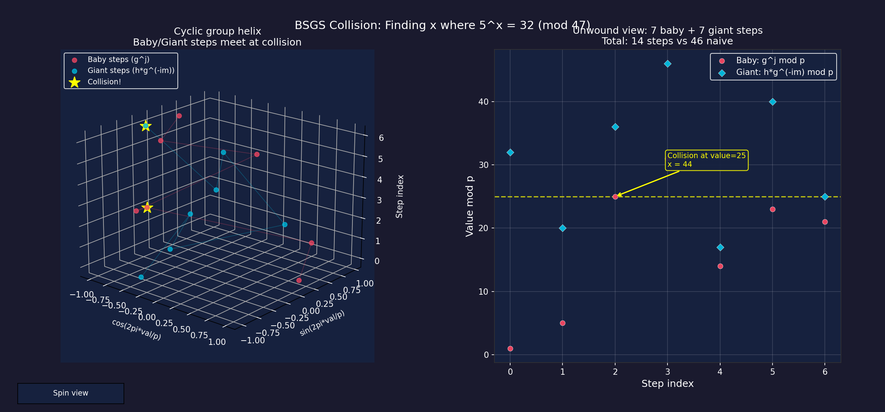

# ElGamal Encryption: Interactive 3D Demo and DLP Visualizations

Python companion to my MAT331 number theory project on ElGamal public key encryption.

The Maple implementation and full writeup are in the main project directory. This repo provides an interactive demo with 3D visualizations demonstrating ElGamal encryption and the computational hardness of the Discrete Logarithm Problem.

## Files

- `elgamal.py` - Core library: keygen, encrypt, decrypt, text message handling, baby-step giant-step DLP solver
- `elgamal_demo.py` - Interactive demo with 5 modes (encrypt/decrypt, BSGS key cracking, 3 interactive 3D visualizations)

### Generated plots

- `dlp_landscape_3d.png` - 3D surface of g^x mod p showing the one-way function's chaotic output
- `ciphertext_cloud_3d.png` - 3D ciphertext scatter (c1, c2, plaintext) showing probabilistic encryption
- `bsgs_helix_3d.png` - 3D cyclic group helix with baby/giant step collision visualization

## Requirements

```
pip3 install matplotlib numpy colorama
```

## Usage

```
python3 elgamal_demo.py
```

The interactive menu offers:

1. **Encrypt / Decrypt** - Generate keys, encrypt a message, decrypt it, see the probabilistic property
2. **Crack a key (BSGS)** - Generate a key and break it with baby-step giant-step
3. **3D: DLP One-Way Landscape** - 3D surface plot of g^x mod p with wireframe toggle, plus 2D slice showing the inverse problem
4. **3D: Ciphertext Cloud** - 3D scatter of (c1, c2, plaintext) showing same-message encryptions form distinct z-layers that overlap in projection, with layer toggle
5. **3D: BSGS Collision Helix** - Cyclic group mapped to 3D helix, baby/giant steps spiral until collision, with spin control

All 3D plots feature interactive rotation, hover annotations, and toggle buttons (matching the style from my MAT200 complex roots visualizer).

## Sample Visualizations



